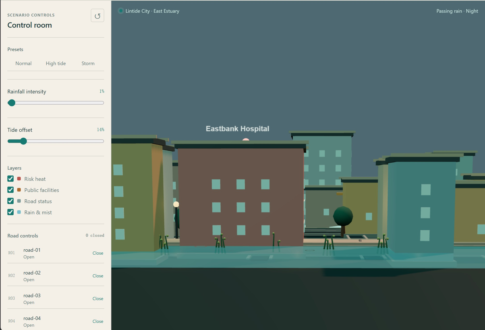
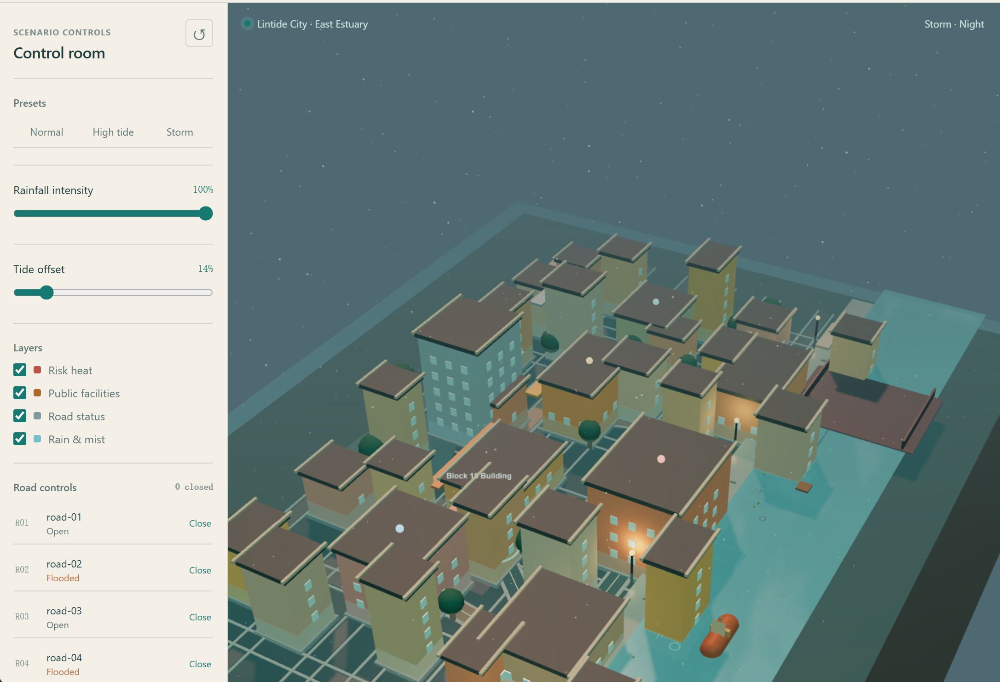
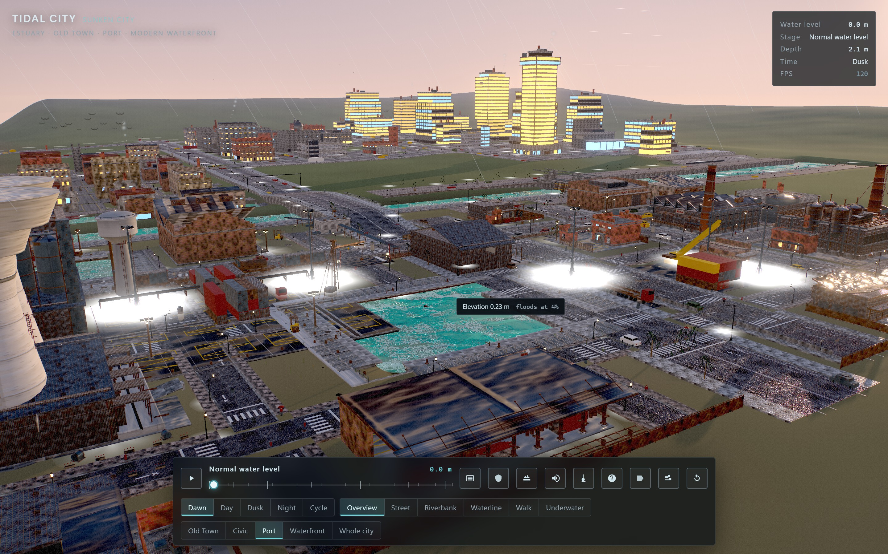
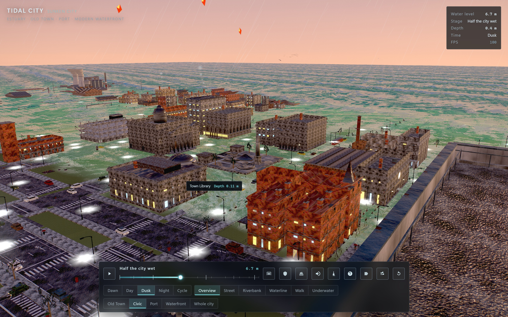
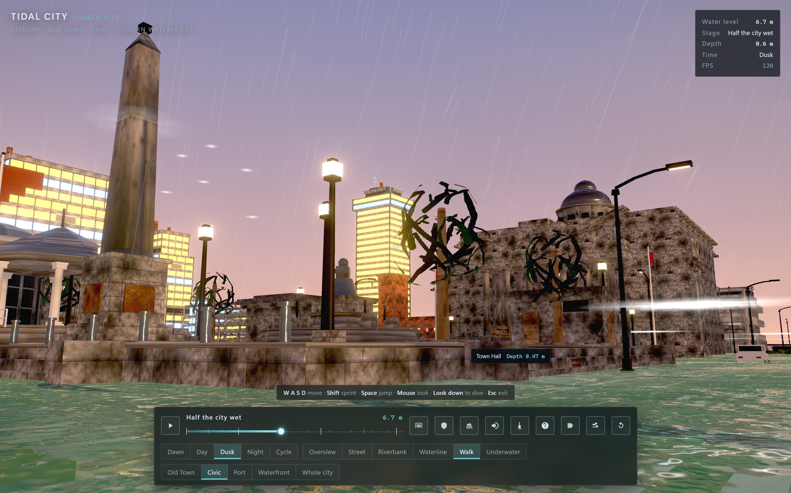
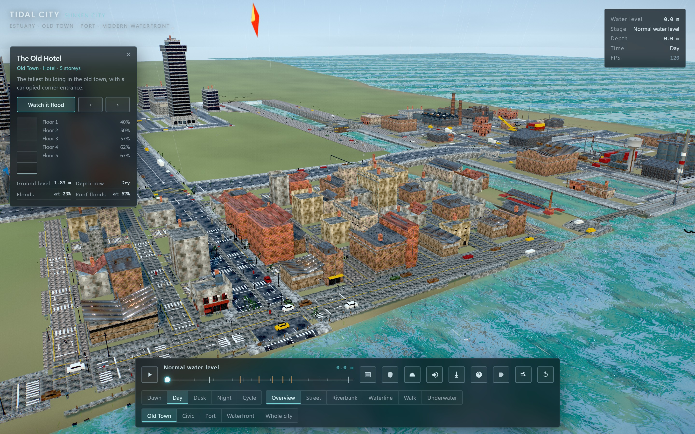
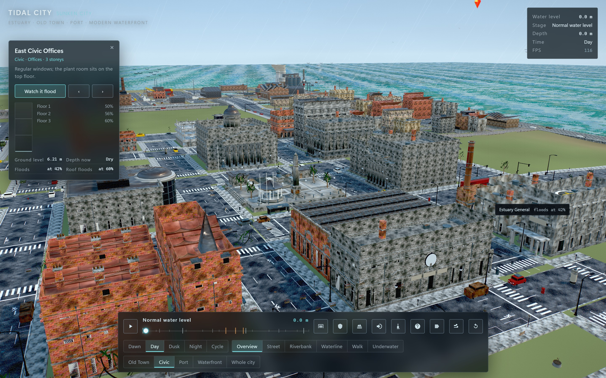

# JevRev

<p align="center">
  
</p>

<p align="center"><strong>LLMに、Jevで鍛えた合金の背骨を。</strong></p>

<p align="center">
  <a href="../README.md">English</a> · <a href="README.zh-CN.md">简体中文</a> · <a href="README.ja.md">日本語</a>
</p>

<p align="center">
  <a href="https://github.com/Alex314618-create/JevRev/releases"></a>
  <a href="../package.json"></a>
  <a href="../LICENSE"></a>
</p>

<p align="center">
  移動: <a href="#実際に動かす">実例</a> · <a href="#3つの構成要素">Sift / Loop / Long</a> · <a href="#任意のagentを接続するクイックスタート">Agentを接続</a> · <a href="#tui人のためのコックピット">TUI</a> · <a href="#jevまたはローカルモデルに接続する">Provider</a> · <a href="#ドキュメント">ドキュメント</a>
</p>

JevRevはLLMとJevを組み合わせたシステムです。生き物は進化の過程で背骨を持ち、たくさんの判断を速く、低コストで行えるようになりました。JevRevもワークフローを同じように分けます。LLMは深い思考と実装力を担い、Jevは非常に速く低コストな判断を担います。その組み合わせで、ワークフローをより効率的にします。

JevRevは3つの部分から成ります。**JevSift**、**JevLoop**、**JevLong**です。

タスクの開始時、LLMはタコのように複数の触手を広げます。それぞれの触手が別の道を探り、弱い道や期待外れの道は切り落とされます。それが**JevSift**です。**JevLoop**は作業の各ラウンドを監査して評価し、その結果からagentの次の動きを決めます。Jevを加えることでワークフローは速く、安くなり、最終成果が大きく改善することもあります。具体的なケースを以下に掲載しています。**JevLong**は長時間・多ラウンドのタスクを監視し、停止、失敗の反復、方向のずれ、ツール呼び出しの問題、予算リスクを検出します。

Jevは脇で判断を支える役割に徹します。経路を選び、判断を返し、注意を促します。提案と実行を担うのはLLMです。JevRevはCLIとJSONプロトコルで動き、host agentのセッションを引き継ぎません。

## 実際に動かす

JevRevが実際に何を変えるのか、いくつかの例で見ていきます。

### 1. Tidal City（まずはこれ）

<details>
<summary>ケースを開く：TidalCityを作る</summary>

同じモデルChatGPT-6-Sol-Ultraに同じプロンプトを与え、潮の満ち引きで浸水する都市シミュレーションTidalCityを作りました。こちらはJevを介入させないbenchmark版です。

<p align="center">
  
  
</p>

いくつかの簡単な建物と道路、基本的な水位上昇のシミュレーションはあります。ただしモデルは粗く、操作は限られています。道路と建物も、構造のないばらばらのパーツとして配置されています。

こちらはJevSift、JevLoop、JevLongを含むJevRevで作った結果です。

<p align="center">
  
</p>
<p align="center">
  
  
</p>
<p align="center">
  
  
</p>

都市はより大きくなり、環境全体も大幅に作り込まれています。複数の地区があり、ほぼすべての建物に名前が付いています。時間帯を変え、カメラを切り替え、WASDで街を歩いたり水中を泳いだりできます。
</details>

### 2. JSONLイベントの取り込み

<details>

<summary>ケースを開く：25,000件のJSONLイベントを処理する</summary>

純粋なNode 20のJSONL ingesterで、production-shapedな25,000件のイベントを次の4つの条件を満たしながら処理するタスクです。

- malformedな行を分離する
- 初出順を保つ
- 重複イベントを1回だけ出力する
- 保守的なbaselineの少なくとも2倍のスループットを達成する

入力は約2.3 MBで、184行のmalformed/schema-invalid行と258個のduplicate IDを含みます。

**JevSiftが行ったこと：**

6つのアプローチをSiftにかけ、JevSiftは厳格なsurvivorを2つ残し、もう1つをreviewに送りました。

| アプローチ | Siftスコア | 結果 |
| --- | ---: | --- |
| `batch-index` | 0.9243 | 残し、実際のprobeへ |
| `regex-shortcut` | 0.9240 | 残し、実際のprobeへ |
| `state-scan` | 0.7965 | 予算で打ち切り |
| `baseline-parse` | 0.6100 | 実行価値が低く却下 |
| `worker-shards` | 0.6043 | review。承認扱いにはしない |
| `external-index` | 0.4931 | 実行価値が低く却下 |

2つのsurvivorには、正確性チェックと7回のbenchmarkを実行しました。

| 指標 | `regex-shortcut` | `batch-index` |
| --- | ---: | ---: |
| 正確性 | 失敗、expected 184 / actual 65 | 成功 |
| 平均スループット（events/s） | 180,530.90 | 180,317.21 |
| 標本標準偏差（n-1） | 8,567.37 | 10,486.05 |
| Decide | rejected | `winner` |

one-shot workflowならregexを選びます。机上では速いものの、malformed行の大半を処理できません。JevRevが`batch-index`を選んだのは、タスクの契約を満たしたからです。

**JevLoopが行ったこと：**

1. ラウンド1：スループットは成功したが、正確性に失敗し、`fix_regression`を返しました。
2. ラウンド2：新しい正確性と保守性のevidenceが成功し、`verify`を返しました。
3. ラウンド3：同じhead上で全基準とprotected surfaceを再提出し、`completed`を返しました。

最終状態は`completed`、ラウンド3。wall-clockは838 ms、replay provider accountingは1,628 tokensでした。

**JevLongが行ったこと：**

- 初回取り込みで13件を受理し、重複取り込みでは0件を受理して13件のduplicateを識別しました。
- `long status`、複数フレームの`long watch`、`long loop-audit`を実行しました。
- 最終sequenceは14でした。
- 高い重大度の`failure_loop` alertとcriticalな`protocol` alertを報告しました。
- Loopは`completed`に到達しましたが、Longの`progress_index`は0のままでした。

</details>

## 3つの構成要素

<picture>
  <source media="(max-width: 600px)" srcset="../.github/assets/jevrev-product-roles-mobile.svg">
  
</picture>

### JevSift：まず何を試すか決める

LLMは、実質的に異なる提案カードをいくつか書き出します。JevSiftはJevに狭い問いを投げ、続いて決定的なポリシーで重複とhard-constraint riskを処理し、残った候補に予算と停止条件付きのprobe work orderを作ります。

Siftが答えるのは1つの問いです。どの方向にtoken budgetを使う価値があるか。コードを書き、テストを実行し、benchmarkを走らせるのはhost agentです。

タスクをSiftにかける価値があるか分からないときは、まずshadow activationを実行します。

```bash
jevrev activation --input activation.json --format json
```

間違った方向へ進んだ場合の予想コストと、いくつかのbounded probeのコストを比較し、安定したreason codeを返します。現在はshadow modeで動作します。Jevを呼び出したり、Siftを代わりに開始・スキップしたりはしません。フィールドと今後の評価計画は[activation policy](ACTIVATION.md)を参照してください。

### JevLoop：各ラウンドをevidenceに収束させる

agentは各ラウンドで作業を前に進めます。JevLoopはrecorderが記録したコマンド、テスト、メトリクス、成果物を読み、結果を確認します。まず事実を確認し、その後Jevに成果に何が足りないかを尋ねます。次のアクションは`fix`、`verify`、`continue`、`replan`、`human`のいずれかになり、目標が実際に満たされるまでLoopは続きます。

Loopは1つの成果を追跡します。agentが実行し、Loopが確認し、Jevが判断します。セッションを引き継いだり、見た目が良いだけの成果に合格印を押したりはしません。完了には、replay可能なevidenceが必ず必要です。

### JevLong：長時間セッションを見える状態にする

Longはagentが書き出すJSONLイベントを読み続け、セッションの進行を記録し、停止、失敗の反復、方向のずれ、ツールの問題、予算リスクを検出します。何が起きたか、セッションが前進しているか、どこに注意が必要かを報告します。

```bash
jevrev long watch --directory .jevrev/long
jevrev long status --directory .jevrev/long --format json
```

## 任意のAgentを接続するクイックスタート

JevRevはCLIとJSON/JSONL契約を通じて外部agentに接続します。Codex、Claude Code、OpenCode、CI workflow、custom harnessはすべて同じプロトコルを使えます。skillに対応したhostは手順を読み込み、それ以外のhostはCLIを直接呼び出せます。

### インストール

```bash
npm install
npm run build
node scripts/install-skill.mjs --target <codex|claude|agents|dsh>
```

使用するhostに合わせて`target`を1つ選びます。OpenCodeやその他のcustom hostでは`--destination <host-skill-directory>`を使えます。

プロンプト例：

```text
Use JevRev: complete this task with Sift, execute only selected approaches, record the evidence, run each round through Loop, and connect Long for long-running work.
```

すぐに完全な例を実行するには：

```bash
npm run demo:workflow
```

## TUI：人のためのコックピット

CLIはagentにコマンドとJSONプロトコルを提供します。TUIはプロジェクト内の各workflowを人がリアルタイムで見るための画面です。

インタラクティブなターミナルで`jevrev`を実行するとコックピットが開きます。Long storeは必要ありません。SessionsにはJevRevのコンポーネントセッションと、Codex、Claude Code、OpenCodeなどから登録されたhost sessionが表示されます。

```bash
jevrev session register --host codex --session-id <id> --title "..." --goal "..."
jevrev session list
```

登録するのはセッションのメタデータだけで、hostの非公開なtranscriptは保存しません。セッションを選ぶと**Kanban / Monitor**ページが開きます。LoopとLongのswitchはそのセッションに保存され、observer storeが利用可能かどうかを表示します。switchはobserverを起動したり、host agentを操作したりしません。

| ページ | 表示内容 |
| --- | --- |
| Sessions | 登録済みhost sessionとJevRevコンポーネントセッション |
| Kanban / Monitor | 作業、evidence、リスク、Loop / Long switch |
| Config | 自動起動、更新間隔、ターミナルカラー |

Up / Downでセッションを選び、Enterで開きます。`l` / `o`とSpaceでmonitor switchを変更できます。コンポーネントコマンドが成功すると、更新されたセッションにフォーカスした状態でコックピットを開けます。自動起動を抑止するには`jevrev --no-tui ...`または`JEVREV_NO_TUI=1`を使います。インタラクティブなターミナルがない場合、JevRevは通常のhuman/JSON出力を保ち、TUI制御シーケンスを出力しません。

## Jevまたはローカルモデルに接続する

Sift、Decide、Loop auditは同じprovider interfaceを使います。hosted Jev、local SemIf、またはoffline実行用のreplay fileに接続できます。認証情報をcommand argument、campaign file、evidence、バージョン管理に含めないでください。

### 初回設定

対話型ターミナルで`jevrev`やprovider関連コマンドを実行し、選択したhosted
providerにkeyがない場合、設定フォームが表示されます。`jev`、`local`、`semif`
を選び、endpointとJev用keyを入力してEnterで保存します。入力中のkeyは伏せ字
ですが、保存されるkeyは**平文であり、暗号化されません**。

- Windows：`%APPDATA%/jevrev/config.json`。未設定時は`~/AppData/Roaming`。
- macOS：`~/Library/Application Support/jevrev/config.json`。
- Linux：`$XDG_CONFIG_HOME/jevrev/config.json`。未設定時は`~/.config`。

`JEVREV_CONFIG_PATH`で別のファイルを指定できます。空でない環境変数は保存値より
優先され、明示的なCLIオプションはendpointとproviderの既定値より優先されます。
環境変数のみ、またはreplayで実行する場合、`jevrev --no-tui ...`か
`JEVREV_NO_TUI=1`でフォームを省略できます。パイプ実行、`--help`、`--version`
では表示されません。Escは保存せずにフォームを閉じ、その後コマンドは続行します。
keyが必要なら失敗する場合があります。[設定とリセットの説明](CONFIGURATION.md)
を参照してください。以下のhosted例は環境変数を使い、keyを保存しません。

### ホスト型Jev

macOS / Linux：

```bash
export JEVREV_JEV_API_KEY="..."

node dist/cli.js sift \
  --input examples/parser-speedup.json \
  --provider jev \
  --output campaign.json
```

Windows PowerShell：

```powershell
$env:JEVREV_JEV_API_KEY = "..."

node dist/cli.js sift `
  --input examples/parser-speedup.json `
  --provider jev `
  --output campaign.json
```

Jev APIのアドレスを変更する場合は`JEVREV_JEV_URL`を設定するか、`--jev-url <api-root>`を渡します。CLIはそのアドレスの`/v1/systemone`へリクエストを送ります。

### ローカルSemIf

Windows：

```powershell
powershell -ExecutionPolicy Bypass `
  -File scripts/start-semif.ps1 -Background

node dist/cli.js sift `
  --input examples/parser-speedup.json `
  --provider semif `
  --output campaign.json
```

ローカルモデルの起動、確認、停止については[`SEMIF_LOCAL.md`](SEMIF_LOCAL.md)を参照してください。

## ドキュメント

- [プロジェクトコックピットの設計](TUI_DESIGN.md)
- [ワークフロー](WORKFLOW.md)
- [Activation policy](ACTIVATION.md)
- [プロトコルとJSON契約](PROTOCOL.md)
- [権限モデル](AUTHORITY.md)
- [JevLoopの設計](JEVLOOP_DESIGN.md)
- [JevLongの設計](JEVLONG_DESIGN.md)
- [受け入れ記録](ACCEPTANCE.md)

JevRevはMITライセンスで公開されています。

[MIT](../LICENSE)
